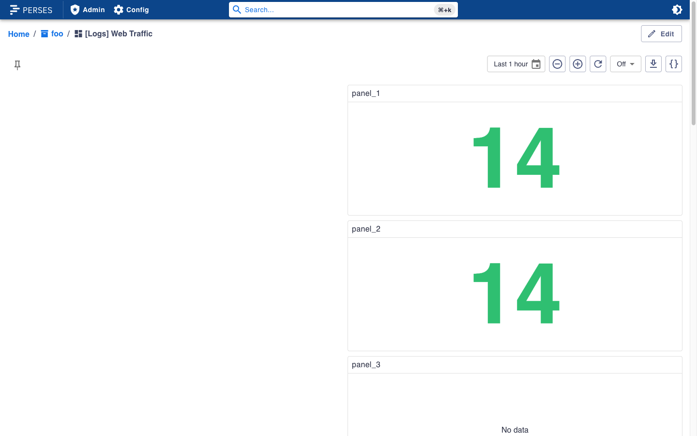
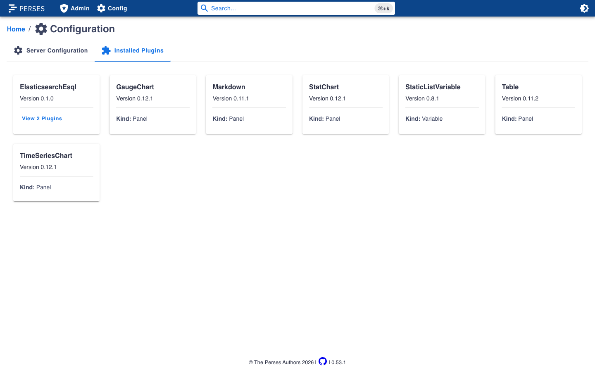

## Kibana Dashboard → Perses (local example)

This doc walks through a full local example of:

- running Perses with the required plugins
- creating a Perses project
- exporting a Kibana dashboard to Perses JSON
- importing that JSON into Perses
- viewing the resulting dashboard in the Perses UI

### Screenshots





### Prerequisites

- **Kibana**: running locally (so you can export a dashboard)
- **Perses** + **percli** installed (example below uses Perses `0.53.1`)
- **Elasticsearch** reachable from Perses (example uses `http://127.0.0.1:9200`)
- **cue** CLI (needed to build a Perses plugin archive): `brew install cue`

### 1) Start Perses with core plugins installed

Perses validates dashboards against plugin schemas. For most dashboards, you’ll want at least:

- panels: `TimeSeriesChart`, `StatChart`, `GaugeChart`, `Table`, `Markdown`
- variables: `StaticListVariable` (commonly used by imports/migrations)

Create a working directory:

```bash
mkdir -p ~/perses-local/plugins-archive ~/perses-local/plugins ~/perses-local/local_db
cd ~/perses-local
```

Download plugin archives (examples):

```bash
curl -L -o plugins-archive/TimeSeriesChart-0.12.1.tar.gz \
  https://github.com/perses/plugins/releases/download/timeserieschart/v0.12.1/TimeSeriesChart-0.12.1.tar.gz

curl -L -o plugins-archive/StatChart-0.12.1.tar.gz \
  https://github.com/perses/plugins/releases/download/statchart/v0.12.1/StatChart-0.12.1.tar.gz

curl -L -o plugins-archive/GaugeChart-0.12.1.tar.gz \
  https://github.com/perses/plugins/releases/download/gaugechart/v0.12.1/GaugeChart-0.12.1.tar.gz

curl -L -o plugins-archive/Table-0.11.2.tar.gz \
  https://github.com/perses/plugins/releases/download/table/v0.11.2/Table-0.11.2.tar.gz

curl -L -o plugins-archive/Markdown-0.11.1.tar.gz \
  https://github.com/perses/plugins/releases/download/markdown/v0.11.1/Markdown-0.11.1.tar.gz

curl -L -o plugins-archive/StaticListVariable-0.8.1.tar.gz \
  https://github.com/perses/plugins/releases/download/staticlistvariable/v0.8.1/StaticListVariable-0.8.1.tar.gz
```

Start Perses:

```bash
perses -web.listen-address 127.0.0.1:8080
```

Verify plugins are loaded:

```bash
curl -s http://127.0.0.1:8080/api/v1/plugins | jq 'map(.metadata.name)'
```

### 2) Create/select a Perses project

```bash
percli login http://127.0.0.1:8080

percli apply -f - <<'EOF'
{
  "kind": "Project",
  "metadata": { "name": "foo" }
}
EOF

percli project foo
```

### 3) Install the Elasticsearch + ES|QL Perses plugins (required for Kibana export)

The Kibana export uses these plugin kinds:

- datasource: `ElasticsearchDatasource`
- query: `ElasticsearchESQLQuery` (inside `TimeSeriesQuery`)

Perses won’t accept the dashboard until those schemas exist on the server.

#### 3a) Generate a plugin module (Datasource + TimeSeriesQuery)

```bash
mkdir -p ~/perses-plugins/elasticsearch-esql

percli plugin generate \
  --module.org=elastic \
  --module.name=elasticsearch-esql \
  --plugin.type=Datasource \
  --plugin.name=ElasticsearchDatasource \
  ~/perses-plugins/elasticsearch-esql

percli plugin generate \
  --module.org=elastic \
  --module.name=elasticsearch-esql \
  --plugin.type=TimeSeriesQuery \
  --plugin.name=ElasticsearchESQLQuery \
  ~/perses-plugins/elasticsearch-esql
```

#### 3b) Ensure the plugin schemas match the export

At minimum, the CUE schemas must validate:

- `ElasticsearchDatasource` with `directUrl` or `proxy`
- `ElasticsearchESQLQuery` with `{ query: string, datasource?: {kind,name?} }`

Here are the minimal CUE schemas used for this example.

Update `schemas/datasources/elasticsearch-datasource/elasticsearch-datasource.cue`:

```cue
package model

import (
  "github.com/perses/shared/cue/common"
  commonProxy "github.com/perses/shared/cue/common/proxy"
)

kind: #kind
spec: {
  #directUrl | #proxy
}

#kind: "ElasticsearchDatasource"

#directUrl: {
  directUrl: common.#url
}

#proxy: {
  proxy: commonProxy.#HTTPProxy
}

#selector: {
  datasource?: =~#variableSyntaxRegex | {
    kind: #kind
    name?: string
  }
}

#variableSyntaxRegex: "^\\$\\w+$"
```

Update `schemas/queries/elasticsearch-esql-query/query.cue`:

```cue
package model

import (
  "strings"
  ds "github.com/elastic/elasticsearch-esql/schemas/datasources/elasticsearch-datasource:model"
)

kind: "ElasticsearchESQLQuery"
spec: close({
  ds.#selector
  query: strings.MinRunes(1)
})
```

Also ensure your module frontend exports and module-federation exposes use the exact casing:

- `ElasticsearchDatasource`
- `ElasticsearchESQLQuery`

#### 3c) Implement minimal frontend runtime (so dashboards actually render)

Schema validation is enough for `percli apply`, but **the Perses UI needs a frontend implementation** of:

- `ElasticsearchDatasource` (to call Elasticsearch)
- `ElasticsearchESQLQuery` (to run ES|QL and map results to Perses time series)

At minimum, make sure:

- `src/index.ts` exports both plugin entrypoints:

```ts
export * from './datasources';
export * from './queries';
```

- `rsbuild.config.ts` exposes the correct module-federation keys (casing matters):

```ts
exposes: {
  './ElasticsearchDatasource': './src/datasources/elasticsearch-datasource/ElasticsearchDatasource',
  './ElasticsearchESQLQuery': './src/queries/elasticsearch-esql-query/ElasticsearchESQLQuery',
},
```

- Your module `package.json` lists both plugins (casing matters):

```json
{
  "perses": {
    "plugins": [
      { "kind": "ElasticsearchDatasource", "type": "Datasource" },
      { "kind": "ElasticsearchESQLQuery", "type": "TimeSeriesQuery" }
    ]
  }
}
```

For local usage, the datasource implementation should `POST` to `/_query` and the query implementation should:

- accept `{ query, datasource }`
- inject the selected Perses time range into the ES|QL query (for example by adding a `WHERE @timestamp >= ... AND @timestamp <= ...` after the `FROM`)
- convert the tabular ES|QL response (`columns` + `values`) into Perses `TimeSeriesData`

Once implemented:

```bash
cd ~/perses-plugins/elasticsearch-esql
npm install
percli plugin build
```

Copy the archive into Perses’ `plugins-archive/` and restart Perses:

```bash
cp ElasticsearchEsql-*.tar.gz ~/perses-local/plugins-archive/
```

Then re-check:

```bash
curl -s http://127.0.0.1:8080/api/v1/plugins | jq 'map(.metadata.name)'
```

You should see `ElasticsearchEsql` in the list.

### 4) Create a project datasource pointing at Elasticsearch (via Perses proxy)

This example uses `elastic:changeme` against `http://127.0.0.1:9200`.

```bash
basic=$(printf 'elastic:changeme' | base64 | tr -d '\n')

percli apply -f - <<EOF
{
  "kind": "Datasource",
  "metadata": {
    "name": "local_elasticsearch",
    "project": "foo"
  },
  "spec": {
    "default": true,
    "plugin": {
      "kind": "ElasticsearchDatasource",
      "spec": {
        "proxy": {
          "kind": "HTTPProxy",
          "spec": {
            "url": "http://127.0.0.1:9200",
            "allowedEndpoints": [
              { "endpointPattern": "/_query", "method": "POST" }
            ],
            "headers": {
              "Authorization": "Basic ${basic}"
            }
          }
        }
      }
    }
  }
}
EOF
```

### 5) Export a Kibana dashboard to Perses JSON

From Kibana’s Dashboard app:

- open a dashboard
- use **Share → Export → Export to Perses**
- set:
  - **Project**: `foo`
  - **Elasticsearch URL**:
    - leave empty if you want Perses to use the **project datasource** created above (recommended; avoids CORS)
    - set it if you want the exported file to embed a **dashboard-scoped datasource** using `directUrl` (you may need Elasticsearch CORS)
- click **Generate**
- download the resulting `*.perses.json`

### 6) Import the JSON into Perses

```bash
percli login http://127.0.0.1:8080
percli project foo

percli lint -f ./my_dashboard.perses.json
percli apply -f ./my_dashboard.perses.json
```

### 7) View the dashboard in Perses

Open Perses and navigate to your project/dashboard:

- Perses UI: `http://127.0.0.1:8080/`
- Direct dashboard URL:
  - `http://127.0.0.1:8080/projects/foo/dashboards/<dashboard-name>`

### Troubleshooting

- **`schema not found for plugin ...`**:
  - The Perses backend doesn’t have the plugin schema loaded. Ensure the plugin archive is in `plugins-archive/` and restart Perses.
- **`variable schemas are not loaded`**:
  - You started Perses without the default plugin archives. Install core plugins (Section 1) and restart Perses.
- **No panel titles**:
  - Perses shows titles when `panel.spec.display.name` is set. The Kibana exporter now ensures it’s always populated.

